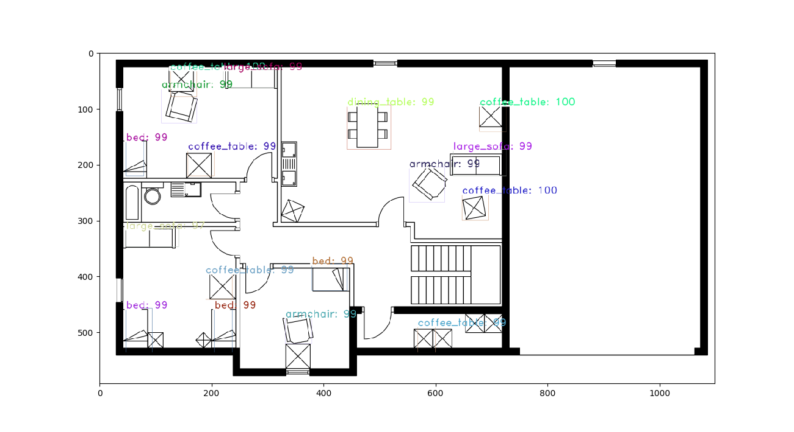
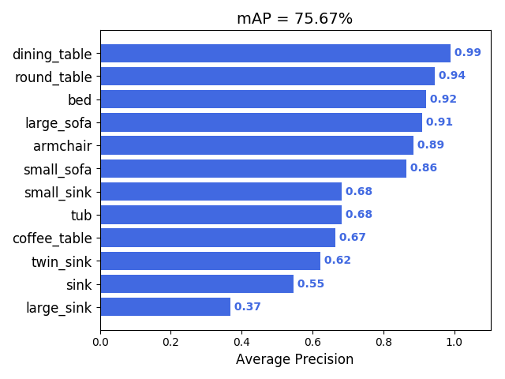

# Object-Detection-in-Floor-Plan-Images
Detection of Objects in a Floor Plan and Architectural Images

There are few models available for doing object detection recognition in an image.
Like RCNN, fast RCNN, faster RCNN, mask RCNN, Yolo, SSD etc.
all of them are developed and configured for natural images. In this project we are working on
document images of floor plans. In a floor plan image, we have objects like dining table, sofa,
sink, etc. 

we used the yolo and faster RCNN for object detection.

used darkflow implementation of yolo https://github.com/thtrieu/darkflow 
  used https://github.com/kbardool/keras-frcnn for frcnn

<b>DATASET-</b>

SESYD, “http://mathieu.delalandre.free.fr/projects/sesyd/symbols/floorplans.html”

ROBIN dataset, [online] Available: “https://github.com/gesstalt/ROBIN.git”

in addition we collected dataset by web scraping from some websites like “architecturalhouseplans.com” and
“houseplans.com”.

<b>YOLO-</b>

<b>SETTING UP-</b>

download the darkflow yolo from above given link.

download weight, cfg files from https://pjreddie.com/darknet/yolo/ there are plenty available and download the one which you need and add them to downloaded darkflow repository in bin and cfg directories respectively.

download dataset from above links or you can use your own and addd them to dataset repository in downloaded darkflow repositor.

<b>TRAINING</b>

<i>assume that you want to use tiny-yolo cfg for training</i>

1. create a copy of configuration file tiny-yolo-voc.cfg and rename it to tiny-yolo-voc-12c.cfg (12c refer to the number of objects or classes we are identifying ) leave the original file unchanged.

2. In tiny-yolo-voc-12c.cfg change classes in the [region] layer (the last layer) to the number of classes you are going to train for. in our case, it is 12.

3. change filters in the [convolutional] layer (the second to last layer) to num * (classes + 5). In our case, num is 5 and classes are 12 so 5 * (12 + 5) = 85 therefore filters are set to 85.

4. Change labels.txt to include the label(s) you want to train on. In our case, labels.txt will contain 12 labels.

5. To train your the model you can run the command- 
python flow --model cfg/tiny-yolo-voc-3c.cfg --load bin/tiny-yolo-voc.weights --train --annotation dataset/train_annotation --dataset dataset/train_images

<b>PREDICTING</b>

1. to predict a single image set the image file path in predict_img.py and run it.  
you can prefer to change in option field like model, load values, epochs, etc.

2. to evalute the images of test set use command- 
python flow --imgdir dataset/test_images --model cfg/tiny-yolo.cfg --load bin/tiny-yolo.weights --json 
output  would be store in json format in dataset/test_images/out directory

<b>FASTER RCNN-</b>

<b>SETTING UP</b>
1. download the frcnn folder from above and set file image directory path.
2. convert xml annotation of train images into text file, for this you can have look at  https://www.analyticsvidhya.com/blog/2018/11/implementation-faster-r-cnn-python-object-detection/

<b>TRAINING</b>

to train model run command- 
python train_frcnn.py -o simple -p train.txt

<b>TESTING</b>
to test model run command-   
python test_frcnn.py -p test_images

Results-

YOLO-
object detected and  accuracy achieved

faster FRCNN-
object detected and accuracy achieved

